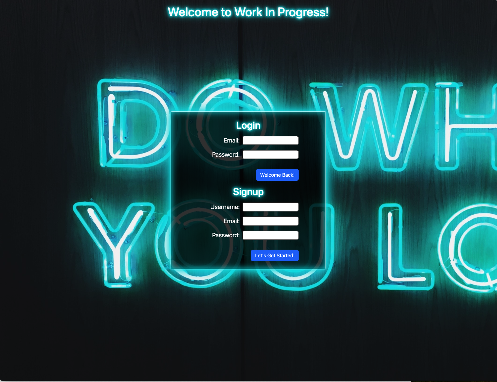

This application is named Work-In-Progress.  With this app, users can naviagte through many available jobs and choose if they would like to apply via an animated swipe/drag or yes and no buttons. They have the ability to save jobs, which will be displayed in a saved jobs page. When users are prompted to sign up they are then re-directed to set up a profile in the profile page.  Users are required to have a user name and password where while logged in, their session details are tracked and their job search information is tracked for information containing to their personal experience. 

